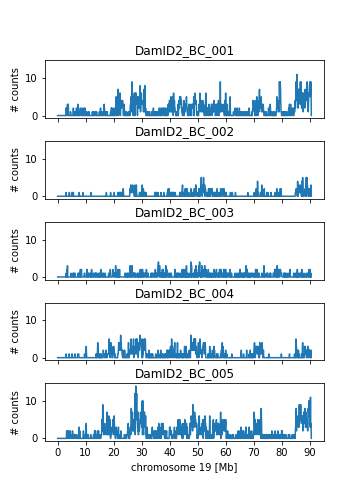

# scDamAndTools

**scDamAndTools** is a set of functions for the processing of raw data generated by scDam&T-seq, a method to simultaneously measure protein-DNA interactions and transcription from single cells (Rooijers _et al_., 2019). scDam&T-seq combines a DamID-based method to measure protein-DNA interactions and an adaptation of CEL-Seq to measure transcription. The starting point of the workflow is raw sequencing data and the end result are tables of UMI-unique DamID and CEL-Seq counts.

## Table of contents
1. [Installation](#installation)
2. [Available functions](#available-functions)
3. [Example usage](#example-usage)
4. [License](#license)
5. [References](#references)

## Installation
**scDamAndTools** was developed in Python 3.6.5 and is compatible with Python 3.6+.

### Setting up a virtual environment
We recommend users to install scDamAndTools and its requirements in a Python virtual environment. In order to generate a virtual environment:

```
python3 -m venv $HOME/.venvs/my_venv
```

To activate the virtual environment:
```
source ~/.venvs/my_venv/bin/activate
```

### Requirements
Install necessary packages:

```
pip install --upgrade pip wheel setuptools
pip install cython
```

### Installing scDamAndTools
```
pip install git+https://github.com/KindLab/scDamAndTools.git
```

## Available Functions
**scDamAndTools** contains eleven functions for the processing of raw sequencing data generated by scDam&T-seq experiments:  

|function|description|
|---|---|
|`add_read_prefix.awk`|Appends additional bases (e.g. "GA") to the beginning of reads.|
|`bin_damid_counts.py`|Bins UMI-unique DamID counts into genomically equal-sized bins.|
|`create_motif_arrays`|Wrapper function that combines all necessary steps to generate motif position and mappability arrays.|
|`demultiplex.py`|Demultiplexes all reads in a library based on their barcode.|
|`fetch_regions.py`|Generates _in silico_ reads of a defined read length for all motif occurrences.|
|`find_motif_occurrences.py`|Finds motif (e.g. "GATC") occurrences genome-wide from a FASTA file.|
|`generate_celseq_counts.py`|Processes aligned CEL-Seq reads into a table of UMI-unique counts.|
|`generate_damid_counts.py`|Processes aligned DamID reads into a table of UMI-unique counts.|
|`process_celseq_reads`|Wrapper function that first alignes the CELseq reads and subsequently calls `generate_celseq_counts.py`.|
|`process_damid_reads`|Wrapper function that first alignes the DamID reads and subsequently calls `generate_damid_counts.py`.|
|`write_posarray.py`|Generates a table with the positions of a motif genome-wide.|

### add_read_prefix.awk
```
add_read_prefix.awk -v PREFIX="GA" infile
```

Takes a FASTQ file as an input and appends the specified prefix to the beginning of all reads. The output in FASTQ format and is directed to STDOUT.

|arguments|option|description|
|---|---|---|
|`infile`|required|FASTQ file with sequence reads. Alternatively, reads can be piped via STDIN.|
|`-v PREFIX=`|required|Sequence to be appended to the beginning of all reads.|

### bin_damid_counts.py
```
bin_damid_counts.py [-h] [--verbose] [--quiet] --outfile OUTFILE [--binsize INT] --posfile HDF5_FILE [--mapfile HDF5_FILE] infiles [infiles ...]
```

Takes one or more position-wise UMI-unique DamID count tables (_HDF5_) as an input and outputs a binned count table with binsizes of the specified size. All input files are summed in the final output file.

|arguments|option|description|
|---|---|---|
|`infiles`|required|HDF5 file(s) of position-wise UMI-unique DamID count table(s).|
|`--outfile`|required|HDF5 file name to write output to.|
|`--binsize`|optional|Size of the genomic bins into which data will be summarized [default: 2000].|
|`--posfile`|required|Location of the motif position array (HDF5).|
|`--mapfile`|required|Location of the motif mappability array (HDF5).|
|`-v/--verbose`|optional|Set level of logging messages.|
|`-q/--quiet`|optional|Silence all logging messages.|

### create_motif_arrays
```
create_motif_arrays [-h] [-m MOTIF] -r READLENGTH -x HISAT2_INDEX -o OUTPREFIX fastafile
```
A wrapper function that combines all necessary steps to generate a motif position and mappability array. It takes the _FASTA_ file of the relevant genome as input and generates a _BED_ file and _HDF5_ file indicating the genome-wide positions of the motif (e.g. "GATC") and generates a _HDF5_ file that indicates whether each motif occurrence can be aligned based on the expected readlength.

|arguments|option|description|
|---|---|---|
|`fastafile`|required|FASTA file of the relevant genomic reference.|
|`-m`|optional|The sequence motif targeted by the used restriction enzyme [default: GATC].|
|`-o`|required|The prefix (including path) for the position and mappability files.|
|`-r`|required|The expected readlength of the sequencing reads (specifically R1), excluding barcode and UMI.|
|`-x`|required|HISAT2 reference index.|

### demultiplex.py
```
demultiplex.py [-h] [--verbose] [--quiet] -o OUTFMT [-m MISMATCHES] [-k] [--verify-no-ambiguous] [--unmatched-outfile FILE] [--ambiguous-outfile FILE] [--infofile FILE] bcfile infiles [infiles ...]
```
Takes one or more raw sequencing files (_FASTQ_) as an input and outputs a file (_FASTQ_) for each DamID/CEL-Seq barcode provided in the barcode file containing all reads matching that barcode.

|arguments|option|description|
|---|---|---|
|`bcfile`|required|TAB-separated file with DamID and CEL-Seq barcode names and barcode sequences corresponding to the samples in the library.|
|`infiles`|required|FASTQ files of raw sequencing reads.|
|`-o/--outfmt`|required|File name format for output files with demultiplexed reads per sample. Should contain a "{name}" field for the barcode name (and a {readname} field for PE input).|
|`-m/--mismatches`|optional|The maximum number of mismatches allowed between the provided barcodes and observed sequences [default: 1].|
|`-k/--keep`|optional|If set, the barcode sequences are not trimmed from the reads [default: False].|
|`--verify-no-ambiguous`|optional|If set, verifies whether two or more provided barcode sequences are inherently ambiguous given the number of allowed mismatches [default: False].|
|`--unmatched-outfile`|optional|Output file (BAM) for reads in the library that could not be matched to any barcode. In the case of PE input, should contain a "{readname}" field.|
|`--ambiguous-outfile`|optional|Output file (BAM) for reads in the library that match multiple barcodes. In the case of PE input, should contain a "{readname}" field.|
|`--infofile`|optional|File in which to report demultiplexing stats.|
|`-v/--verbose`|optional|Set level of logging messages.|
|`-q/--quiet`|optional|Silence all logging messages.|

### fetch_regions.py
```
fetch_regions.py [-h] -l LENGTH [--verbose] [--quiet] bedfile fastafile
```

Takes a file (_BED_) of genome-wide motif occurrences and a reference genome sequence (_FASTA_) as input and generates _in silico_ reads based on motif occurrences and desired read length.

|arguments|option|description|
|---|---|---|
|`bedfile`|required|BED file containing the motif occurrences genome-wide.|
|`fastafile`|required|FASTA file containing the reference genome sequence.|
|`-l/--length`|required|Length (in bp) of the _in silico_ reads to be generated.|
|`-v/--verbose`|optional|Set level of logging messages.|
|`-q/--quiet`|optional|Silence all logging messages.|

### find_motif_occurrences.py
```
find_motif_occurrences.py [-h] filename motif
```

Takes a (gzipped) genome reference file (_FASTA_) as input and finds all positions at which the provided motif occurs. Outputs the found positions in BED format to STDOUT. Note, does not handle revcomp well. But that doesn't matter if your motif is itself palindromic.

|arguments|option|description|
|---|---|---|
| `filename`|required|Genome reference file name (FASTA).|
|`motif`|required|Motif to be found (e.g. "GATC").|

### generate_celseq_counts.py
```
generate_celseq_counts.py [-h] [--verbose] [--quiet] --gtf GTF [--mode {intersection-strict,intersection-nonempty,union}] [--min-mapq MIN_MAPQ] [--outfile HDF5_FILE] bamfile [bamfile ...]
```

Takes an alignment file (_BAM_) as input and generates a table of UMI-unique transcript counts in _HDF5_ format, containing the number of observed UMI-unique transcripts per gene, sorted by their ENSEMBL ID as provided in the GTF file. Whether an alignment is considered to overlap a feature is determined by the choice of overlap mode. The available modes are modeled after the [HTseq modes](https://htseq.readthedocs.io/en/release_0.11.1/count.html).

|arguments|option|description|
|---|---|---|
|`bamfile`|required|Input BAM file(s) of aligned CEL-Seq reads.|
|`-g/--gtf`|required|Reference GTF file.|
|`-m/--mode`|required|Overlap mode for aligning reads to features. Based on HTseq. Options: {intersection-strict, intersection-nonempty, union}.|
|`--min-mapq`|optional|Minimum mapping quality of aligned reads. Reads below the threshold are discarded [default: 0].|
|`-o/--outfile`|optional|Output file (HDF5) to store UMI-unique transcript counts. If not provided, output is send to STDOUT as a table of geneid and associated counts.|
|`--save-stats`|optional|If set, a text file containing the CEL-Seq counting statistics will be generated [default: False].|
|`-v/--verbose`|optional|Set level of logging messages.|
|`-q/--quiet`|optional|Silence all logging messages.|

### generate_damid_counts.py
```
generate_damid_counts.py [-h] [--verbose] [--quiet] --outfile OUTFILE [--invalid-outfile INVALID_OUTFILE] [--min-mapq MIN_MAPQ] [--umi-length UMI_LENGTH] [--keep-n KEEP_N] [--min-editdistance MIN_EDITDISTANCE] --pos-file HDF5_FILE infile
```

Takes an alignment file (_BAM_) as input and generates a table of UMI-unique GATC counts (_HDF5_).

|arguments|option|description|
|---|---|---|
|`infile`|required|BAM input file of aligned DamID reads sorted by genomic position. Use "-" when reads are piped from STDIN.|
|`--pos-file`|required|Motif position file (HDF5).|
|`--outfile`|required|Output file (HDF5) to which UMI-unique counts are written.|
|`--invalid-outfile`|optional|Output file (BAM) to store invalid reads (i.e. too low mapping quality or not aligning to a GATC).|
|`--min-mapq`|optional|Minimum mapping quality of aligned reads. Reads below the threshold are discarded [default: 0].|
|`--umi-present`|optional|If set, available UMI information will be used to remove PCR duplicates [default: False].|
|`--keep-n`|optional|Maximum number of unique UMIs to allow per position [default: keep all].|
|`--min-editdistance`|optional|Minimum edit distance between pairs of UMIs that are observed per position [default: 1].|
|`--save-stats`|optional|If set, a text file containing the DamID counting statistics will be generated [default: False].|
|`-v/--verbose`|optional|Set level of logging messages.|
|`-q/--quiet`|optional|Silence all logging messages.|

### process_celseq_reads
```
process_celseq_reads [-h] -o OUTPREFIX -g GTF -x HISAT2_INDEX fastqfile
```

Wrapper script that aligns CEL-Seq reads (using HISAT2) and subsequently calls `generate_celseq_counts.py`. The function takes CEL-Seq reads (_FASTQ_) as input and outputs a alignment file (_BAM_) and count file (_HDF5_), containing the number of observed UMI-unique transcripts per gene, sorted by their ENSEMBL ID as provided in the GTF file.

|arguments|option|description|
|---|---|---|
|`fastqfile`|required|FASTQ file containing CEL-Seq reads.|
|`-o`|required|The prefix (including path) for the generated alignment and count file.|
|`-g`|required|GTF file for the relevant genome reference.|
|`-x`|required|HISAT2 index for the relevant genome reference.|
|`-q`|optional|Minimum mapping quality to retain read [default: 10].|

### process_damid_reads
```
process_damid_reads [-h] [-m PREFIX] [-q MIN_MAPQ] [-u] [-k KEEP_N] [-d MIN_EDITDISTANCE] -o OUTPREFIX -p POSARRAY -x HISAT2_INDEX fastqfile
```

Wrapper script that aligns DamID reads (using HISAT2) and subsequently calls `generate_damid_counts.py`. The function takes DamID reads (_FASTQ_) as input and outputs a alignment file (_BAM_) and count file (_HDF5_), containing the number of observed (UMI-unique) counts per motif occurrence.

|arguments|option|description|
|---|---|---|
|`fastqfile`|required|FASTQ file containing DamID reads.|
|`-o`|required|The prefix (including path) for the generated alignment and count file.|
|`-p`|required|Motif position file for the relevant genome reference.|
|`-x`|required|HISAT2 index for the relevant genome reference.|
|`-m`|optional|Motif prefix to append to reads [default: GA].| 
|`-q`|optional|Minimum mapping quality of aligned reads. Reads below the threshold are discarded [default: 0].|
|`-u`|optional|If set, available UMI information will be used to remove PCR duplicates [default: False].|
|`-k`|optional|Maximum number of unique UMIs to allow per position [default: 4].|
|`-d`|optional|Minimum edit distance between pairs of UMIs that are observed per position [default: 2].|

### write_posarray.py
```
write_posarray.py [-h] [-l ELEMENT_LENGTH] --outfile OUTFILE pos_file
```

Takes a _BED_ file describing all motif occurrences and generates a table in _HDF5_ format with all motif positions genome-wide. For each chromosome, the first entry is the position of the first motif occurrence on the plus strand, subsequent values represent the distance to the next motif. Only positions on the plus strand are indicated, motif positions on the minus strand can be inferred.

|arguments|option|description|
|---|---|---|
|`pos_file`|required|BED input file with motif positions.|
|`--outfile`|required|Output file name (HDF5) for posarray.|
|`-l/--element-length`|optional|Length of the motif in bp (e.g. 4 for the GATC motif) [default: infer length from input].|

## Example usage

The analysis steps in this and subsequent sections demonstrate how scDam&T-seq data can be analysed using the provided software package (scDamAndTools). File names and genome references are chosen to match the test data available as part of the package. Care should be taken to modify these when applying the analysis on other data. In some parts of the workflow, we offer the option to use a wrapper script to combine multiple processing steps. Although these wrapper scripts ease the workflow, they are less customizable. When applying scDamAndTools in a custom workflow, the individual steps offer more flexibility. 

### Software requirements
Many of the functions provided in the scDamAndTools package are Python3-based and can be easily incorporated in a custom workflow. An exception this are the wrapper functions "create_motif_refarrays", "process_celseq_reads" and "process_damid_reads", which are bash scripts. The workflow as explained below was developed using the following environment and tools:

- Unix/Linux operating system (used version: Ubuntu 16.04.6 LTS)
- Bash Shell (used version: version 4.3.48(1)-release)
- HISAT2 (https://ccb.jhu.edu/software/hisat2/index.shtml, used version: v2.1.0)
- Python3 (https://www.python.org, used version: v3.6.3)
- Samtools (http://www.samtools.sourceforge.net, used version: v1.6)

### Tutorial data
We have included a [test dataset](tutorial/) set as part of this repository. In the following steps, we will demonstrate how the scDam&Tools package can be implemented to analyse this data. The data comes from a mouse Embryonic Stem Cell (mESC) line expressing Dam-LaminB1. As such, we expect that the resulting DamID profiles show Lamina-Associated Domains (LADs). The raw sequencing data contains downsampled DamID and CEL-Seq reads of five single cells.

### Downloading genome reference files and generating HISAT2 index 
- *Step 1:* For the purpose of this tutorial, the FASTA file, GTF file and HISAT2 index will all be placed in a folder named “references”. For that reason, generate this folder in your own working directory, or replace all mentions of the “references” directory with the path of your own choice:..
```mkdir ./references```

- *Step 2:* Download the reference sequence of the relevant species, for example from [the ensembl webpage](http://www.ensembl.org/info/data/ftp/index.html). Click the “DNA (FASTA)” link and download the file ending with ‘dna.primary_assembly.fa.gz’. Save the file in the “references” directory.

- *Step 3:* Download the GTF file for the relevant species, for example from [the ensembl webpage](http://www.ensembl.org/info/data/ftp/index.html). Place the downloaded file in the “references” directory.

- *Step 4:* If using ERCC spike-ins, their sequences should be added to the genome FASTA file and the GTF file. 

- *Step 5:* Generate a HISAT2 index:
```
HISAT2_INDEX="./references/Mus_musculus.GRCm38.dna.primary_assembly.with_ERCC"
FASTAFN="./references/Mus_musculus.GRCm38.dna.primary_assembly.with_ERCC.fa"
hisat2-build $FASTAFN $HISAT2_INDEX
```

### Generate GATC reference arrays
To efficiently match obtained DamID reads to specific instances of the GATC motif in the genome, we generate two reference arrays. The first array (“position array” or “posarray”) contains the positions of all GATC positions in the genome. The second array (“mappability array” or “maparray”) indicates whether it is possible to uniquely align a read derived from a particular (strand-specific) GATC instance. The mappability array is used to filter out ambiguously aligning GATCs and can serve as an indicator of the (mappable) GATC density along the chromosomes. During the generation of the mappability array, in silico reads are generated for each GATC instance and are subsequently mapped back to the reference genome. The length of the reads should be chosen to be the same as the length of the reads obtained in the experiment (excluding the adapter).

#### Option 1: Using the wrapper script
- *Step 6.1:* Generate the motif position and mappability arrays:
```
IN_SILICO_READLENGTH=65
ARRAY_PREFIX="./refarrays/Mus_musculus.GRCm38.dna.primary_assembly"
create_motif_refarrays \
    -m "GATC" \
    -o $ARRAY_PREFIX \
    -r $IN_SILICO_READLENGTH \
    -x $HISAT2_INDEX \
    $FASTAFN
```

#### Option 2: Performing the individual steps
- *Step 6.1:* Find “GATC” occurrences in genome:
```
mkdir ./refarrays/
find_motif_occurrences.py \
    $FASTAFN \
    "GATC" \
| awk '$1 !~ /^ERCC/' \
| gzip > ./refarrays/Mus_musculus.GRCm38.dna.primary_assembly.GATC.positions.bed.gz
```
GATC positions in the ERCC sequences are discarded, since these are not present in the genomic DNA of the cells.

- *Step 6.2:* Generate an HDF5 file with all GATC positions in the genome:
```
write_posarray.py \
    --outfile ./refarrays/Mus_musculus.GRCm38.dna.primary_assembly.GATC.posarray.hdf5 \
    ./refarrays/Mus_musculus.GRCm38.dna.primary_assembly.GATC.positions.bed.gz
```

- *Step 6.3:* Generate _in silico_ reads mapping to GATC positions and align these back to the reference to determine the mappability of the positions:
```
IN_SILICO_READLENGTH=65;
fetch_regions.py \
    -q \
    -l $IN_SILICO_READLENGTH \
    ./refarrays/Mus_musculus.GRCm38.dna.primary_assembly.GATC.positions.bed.gz \
    $FASTAFN \
| hisat2 \
  --seed 42 \
  -f \
  -x $HISAT2_INDEX \
  -U - \
  --no-spliced-alignment \
  --mp '2,0' \
  --sp '4,0' \
| samtools view -ub - \
| samtools sort -m 500M -l 9 \
> ./refarrays/Mus_musculus.GRCm38.dna.primary_assembly.GATC.readlength_65.sorted.bam
```

- *Step 6.4:* Use the aligned _in silico_ reads to generate a mappability array:
```
generate_damid_counts.py \
    -vvv \
    --outfile ./refarrays/Mus_musculus.GRCm38.dna.primary_assembly.GATC.readlength_65.maparray.hdf5 \
    --pos-file ./refarrays/Mus_musculus.GRCm38.dna.primary_assembly.GATC.posarray.hdf5 \  
    ./refarrays/Mus_musculus.GRCm38.dna.primary_assembly.GATC.readlength_65.sorted.bam
```

#### Expected output
At the end of these steps, four files should have been generated, ending in ending in “.positions.bed.gz” (all occurrences of the GATC motif in _BED_ format), “.posarray.hdf5” (all occurrences of the GATC motif as a _HDF5_ array), ".sorted.bam" (alignment of the _in silico_ generated reads in _BAM_ format) and “.maparray.hdf5” (the mappability of all GATC motifs as a _HDF5_ array). In case the wrapper script was used, the alignment file (_BAM_) has been automatically deleted.

### Demultiplexing the raw sequencing data
In this step, the raw sequencing reads are split into multiple files based on their barcodes. For each barcode, a separate file will be made. Reads that do not match any barcode or that match multiple barcodes can be stored in separated files.

- *Step 7:* If not already done so by the sequencing facility, demultiplex the raw data based on the used Illumina indices.

- *Step 8:* Create a file that describes the barcodes that were used in the library. The file should have two columns, listing the adapter names and sequences respectively. The location and length of UMIs should be indicated with numbers and dashes. Using DamID barcodes with a 3 nucleotide UMI and CEL-Seq primers with a 6 nucleotide UMI, the barcode file of a library with two samples should look as follows:
```
DamID_BC_001   3-CTTCAAGA
DamID_BC_002   3-AGCCATGA
CELseq_BC_001  6-CTGTACAA
CELseq_BC_002  6-ATTCCTAG
```
Example data and relevant barcode file are included in the scDamAndTools package in the [tutorial](/tutorial) folder.

NOTE: There may be multiple raw sequencing files pertaining to the same samples, for example from the different sequencing lanes. These files should be concatenated, latest prior to the sorting of aligned reads. 

- *Step 9:* For each Illumina library, demultiplex the reads based on the used adapters. Make sure the output file format contains the fields “{name}” and “{readname}”, where the barcode name and paired-end read name will be inserted:
```
OUTFMT=“./data/demultiplexed/index01.{name}.{readname}.fastq.gz"
INFOFN=“./data/demultiplexed/index01.demultiplex_info.txt"
demultiplex.py \
    -vvv \
    --mismatches 0 \
    --outfmt $OUTFMT \
    --infofile $INFOFN \
    ./metadata/index01.barcodes.tsv \
    ./data/raw/index01_R1_001.fastq.gz \
    ./data/raw/index01_R2_001.fastq.gz
```

#### Expected output
The demultiplex script generates a separate _FASTQ_ file for each barcode provided in the barcode information file (see step 8) that contains all reads matching this barcode. In addition, a text file (“index01.demultiplex_info.txt”) is generated that details the number of reads matched to each barcode:
```
ambiguous       0
matching_mismatch       0
matching_perfect        500000
unmatching      0
CELseq_BC_001   4411    0
CELseq_BC_002   4363    0
CELseq_BC_003   2586    0
CELseq_BC_004   2070    0
CELseq_BC_005   1835    0
DamID_BC_001    70059   0
DamID_BC_002    82740   0
DamID_BC_003    160589  0
DamID_BC_004    66915   0
DamID_BC_005    104432  0
```
In this case, there are no reads ambiguous or unmatched barcodes, since the test dataset represents a downsampled version of several samples that have previously been selected on their barcode. In a typical experiment, 5-10% of reads cannot be unambiguously matched to any barcode.

### Processing the DamID reads to counts
The subsequent steps need to be performed on all DamID demultiplexed files. It is highly recommended that this process be parallelized on a high-performance computing cluster. The amount of time necessary for these steps depends entirely on the number of libraries, samples per library and available computing cores.

#### Option 1: Using the wrapper script
- *Step 10.1:* Process the DamID reads to arrays of (UMI-unique) GATC counts. The script aligns the DamID reads to the genome and subsequently matches them to positions as indicated in the position array (see step 6). Since the GATC motif is cleaved in half by DpnI, the prefix “GA” is added to all reads prior to alignment. PCR-duplicates are filtered out based on the available UMI information. For this step, only the R1 reads are used since these contain the fragment aligning to the GATC motif:
```
OUTPREFIX="./data/damid/index01.DamID_BC_001";
POSARRAY="./refarrays/Mus_musculus.GRCm38.dna.primary_assembly.GATC.posarray.hdf5";
process_damid_reads \
    -o $OUTPREFIX \
    -m "GA" \
    -p $POSARRAY \
    -x $HISAT2_INDEX \
    -u \
    ./data/demultiplexed/index01.DamID_BC_001.R1.fastq.gz
```
The script generates an alignment file ending in “.sorted.bam”, a GATC count file ending in “.counts.hdf5” and an information file ending in “.counts.stats.tsv”.

- *Step 10.2:* Bin the GATC count files into genomically equal-sized bins. The resulting HDF5 file contains for each chromosome the number of observed UMI-unique counts for each bin:
```
MAPARRAY=“./refarrays/Mus_musculus.GRCm38.dna.primary_assembly.GATC.readlength_65.maparray.hdf5”
OUTFN=“./data/damid/index01.DamID_BC_001.counts.binsize_100000.hdf5"
bin_damid_counts.py \
    -vvv \
    --mapfile $MAPARRAY \
    --posfile $POSARRAY \
    --binsize 100000 \
    --outfile $OUTFN \
    ./data/damid/index01.DamID_BC_001.counts.hdf5
```

#### Option 2: Performing the individual steps
- *Step 10.1:* The restriction enzyme DpnI cuts the GATC motif in half and consequently the obtained reads start with “TC”. Add the “GA” prefix to all reads and align to the reference genome:
```
mkdir ./data/damid/
POSARRAY="./refarrays/Mus_musculus.GRCm38.dna.primary_assembly.GATC.posarray.hdf5";
gzip -dc ./data/demultiplexed/index01.DamID_BC_001.R1.fastq.gz \
| add_read_prefix.awk -v PREFIX="GA" \
| hisat2 \
    --seed 42 \
    -x $HISAT2_INDEX \
    -U - \
    --no-spliced-alignment \
    --mp '2,0' \
    --sp '4,0' \
| samtools view -ub - 
| samtools sort 
    -m 500M 
    -T ./data/damid/index01.DamID_BC_001.sort_tmp 
    -l 9 
    - 
> ./data/damid/index01.DamID_BC_001.sorted.bam
```

- *Step 10.2:* Generate UMI-unique GATC count files from the alignments. The resulting HDF5 file contains for each chromosome the number of observed UMI-unique counts for each strand-specific GATC:
```
generate_damid_counts.py \
    -vvv \
    --outfile "./data/damid/index01.DamID_BC_001.counts.hdf5" \
    --min-mapq 10 \
    --umi-present \
    --keep-n 4 \
    --min-editdistance 2 \
    --pos-file $POSARRAY \
    --save-stats \
    ./data/damid/index01.DamID_BC_001.sorted.bam
```

- *Step 10.3:* Bin the GATC count files into genomically equal-sized bins. The resulting HDF5 file contains for each chromosome the number of observed UMI-unique counts for each bin:
```
MAPARRAY=“./refarrays/Mus_musculus.GRCm38.dna.primary_assembly.GATC.readlength_65.maparray.hdf5”
OUTFN=“./data/damid/index01.DamID_BC_001.counts.binsize_100000.hdf5"
bin_damid_counts.py \
    -vvv \
    --mapfile $MAPARRAY \
    --posfile $POSARRAY \
    --binsize 100000 \
    --outfile $OUTFN \
    ./data/counts/index01.DamID_BC_001.counts.hdf5
```

#### Expected output
After running the above steps, the following files have been generated:
```
index01.DamID_BC_001.counts.binsize_100000.hdf5
index01.DamID_BC_001.counts.hdf5
index01.DamID_BC_001.counts.stats.tsv
index01.DamID_BC_001.sorted.bam
```
The _BAM_ file contains the aligned DamID reads, the _HDF5_ file ending in ".counts.hdf5" contains the number of unique fragments observed per strand-specific GATC positions, the _HDF5_ file ending in ".binsize_100000.hdf5" contains the number of observed unique fragments per 100kb bin. Finally, the text file ending in ".stats.tsv" contains the processing statistics:
```
index01.DamID_BC_001.counts.hdf5    total_reads     70059
index01.DamID_BC_001.counts.hdf5    unmapped_reads  14043
index01.DamID_BC_001.counts.hdf5    lowmapq_reads   6572
index01.DamID_BC_001.counts.hdf5    nongatc_reads   10613
index01.DamID_BC_001.counts.hdf5    invalidumi_reads        1
index01.DamID_BC_001.counts.hdf5    valid_reads     38830
index01.DamID_BC_001.counts.hdf5    unique_counts   31702
```

Plotting the binned counts observed over chromosome 19 yields the following enrichment profiles:

These enrichment profiles are in line with the output we expect for a Dam-LaminB1 cell line.

### Processing the CEL-Seq reads to counts
The subsequent steps need to be performed on all CEL-Seq demultiplexed files. It is highly recommended that this process be parallelized on a high-performance computing cluster. The amount of time necessary for these steps depends entirely on the number of libraries, samples per library and available computing cores.


#### Option 1: Using the wrapper script
- *Step 11.1:* Process the CEL-Seq reads to an array of UMI-unique counts per gene. For this step, the R2 reads are used, since these contain the genomic sequence:
```
OUTPREFIX="./data/celseq/index01.CELseq_BC_001"
GTF="./references/Mus_musculus.GRCm38.98.with_ERCC.gtf.gz"
process_celseq_reads \
    -o $OUTPREFIX \
    -g $GTF \
    -x $HISAT2_INDEX \
    ./data/demultiplexed/index01.CELseq_BC_001.R2.fastq.gz
```

#### Option 2: Performing the individual steps
- *Step 11.1:* Align all CEL-Seq reads to the reference genome:
```
hisat2 \
  --seed 42 \
  -x $HISAT2_INDEX \
  -U ./data/demultiplexed/index01.CELseq_BC_001.R2.fastq.gz \
  --mp '2,0' \
  --sp '4,0' \
  > ./data/celseq/index01.CELseq_BC_001.bam
```

- *Step 11.2:* From the aligned CEL-Seq reads, generate an HDF5 file that contains for each gene the number of UMI-unique transcripts that were observed:
```
GTF="./references/Mus_musculus.GRCm38.98.with_ERCC.gtf.gz"
generate_celseq_counts.py \
  -vvv \
  --gtf $GTFFN \
  --mode intersection-strict \
  --min-mapq 10 \
  --outfile ./data/celseq/index01.CELseq_BC_001.counts.hdf5 \
  --save-stats \
  ./data/celseq/index01.CELseq_BC_001.bam
```

#### Expected output
After running the above steps, the following files have been generated:
```
index01.CELseq_BC_001.bam
index01.CELseq_BC_001.counts.hdf5
index01.CELseq_BC_001.counts.stats.tsv
```
The _BAM_ file contains the aligned CEL-Seq reads, while the _HDF5_ file contains the number of observed UMI-unique transcripts per gene, sorted by their Ensembl gene ID as provided in the GTF file. Finally, the text file ending in ".stats.tsv" contains the processing statistics:
```
index01.CELseq_BC_001.counts.hdf5   total_reads     4411
index01.CELseq_BC_001.counts.hdf5   valid_reads     192
index01.CELseq_BC_001.counts.hdf5   ambiguous_reads 19
index01.CELseq_BC_001.counts.hdf5   no_feature_reads        3133
index01.CELseq_BC_001.counts.hdf5   unmapped_reads  675
index01.CELseq_BC_001.counts.hdf5   lowmapq_reads   392
index01.CELseq_BC_001.counts.hdf5   unique_counts   191
```

## License
**scDamAndTools** is licensed under **MIT**. The detailed license terms are in the **LICENSE** file.

## References

Original research paper describing scDam&T-seq:  
- Rooijers, K., Markodimitraki, C. M., Rang, F. J., de Vries, S. S., Chialastri, A., de Luca, K. L., Mooijman, D., Dey, S. S. & Kind, J. (2019). Simultaneous quantification of protein–DNA contacts and transcriptomes in single cells. _Nature biotechnology_, 37(6), 766.

Elaborate description of protocol and analysis:  
- Markodimitraki, C. M., Rang, F.J., ..., Kind, J. (2019). scDam&T-seq for simultaneous quantification of protein-DNA interactions and transcriptomes in single cells. (2019). _unpublished_.
